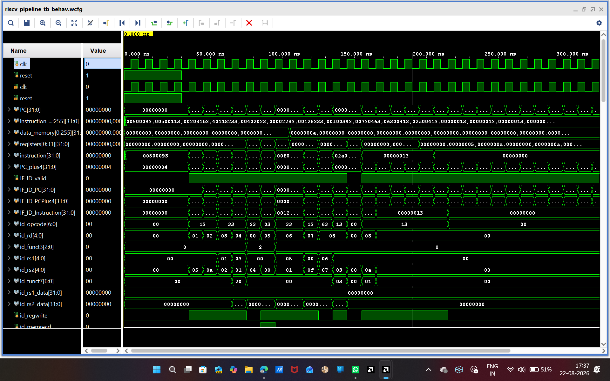
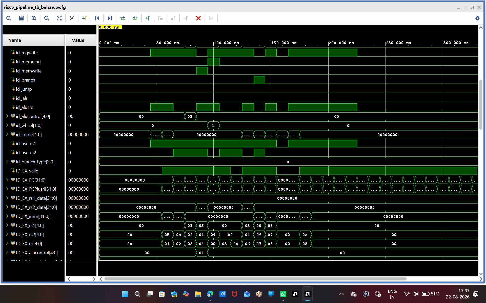
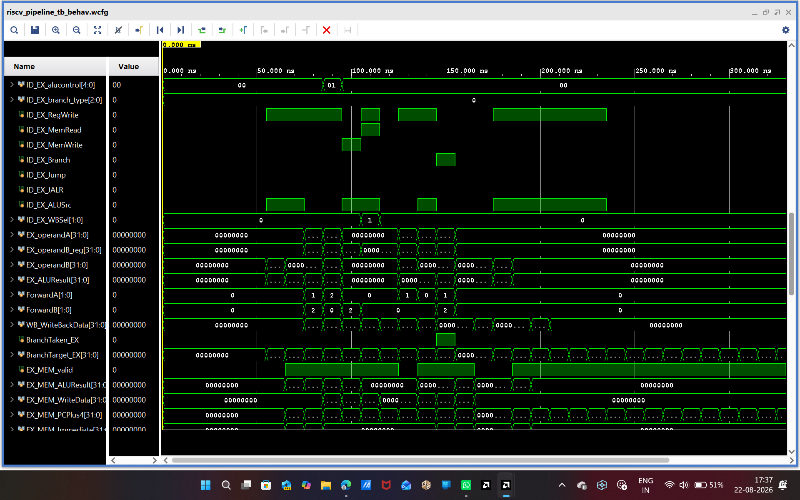
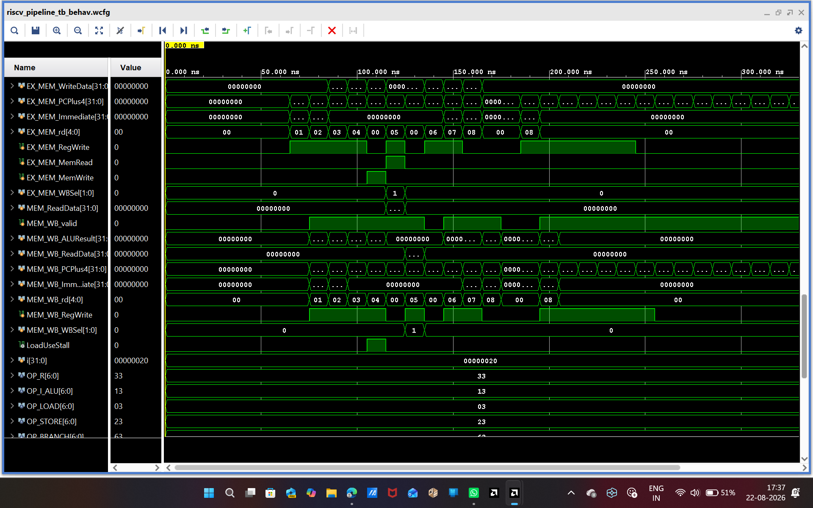
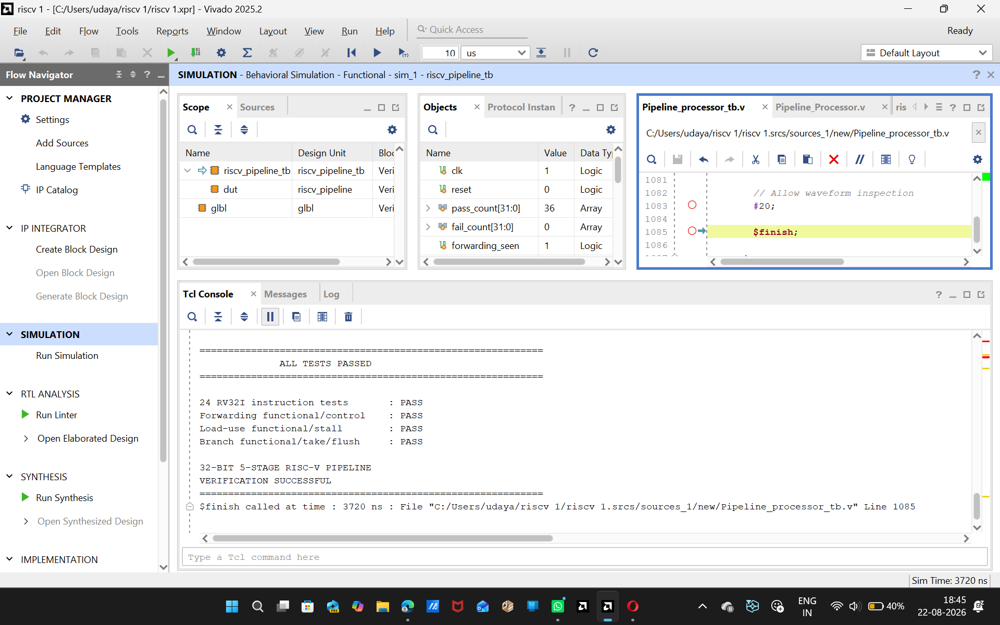
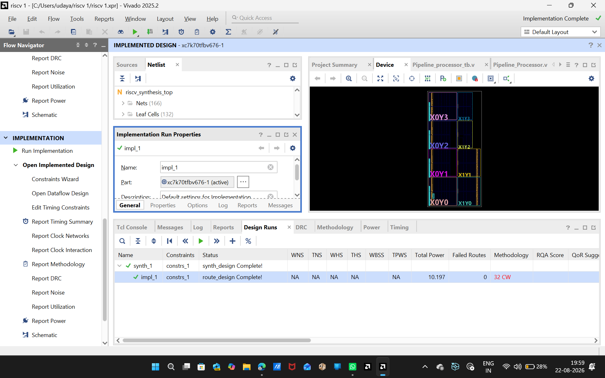
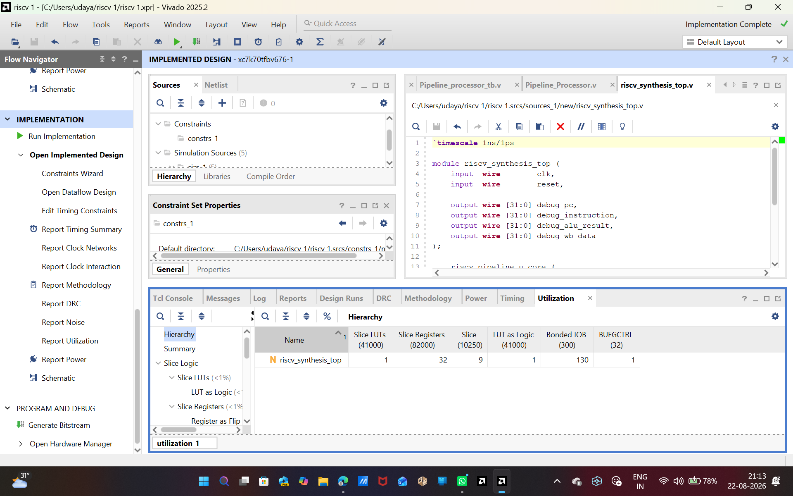

# 32-bit 5-Stage Pipelined RISC-V Processor

A 32-bit five-stage pipelined RISC-V processor implemented in Verilog-2001 and verified using Xilinx Vivado. The design implements a selected RV32I instruction subset with data forwarding, load-use hazard detection, pipeline stalling, branch and jump handling, and pipeline flushing.

**Pipeline:** IF → ID → EX → MEM → WB

---

## Table of Contents

- [Project Overview](#project-overview)
- [Objectives](#objectives)
- [Architecture](#architecture)
- [Pipeline Stages](#pipeline-stages)
- [Features](#features)
- [Supported and Verified Instructions](#supported-and-verified-instructions)
- [Hazard Handling](#hazard-handling)
- [Forwarding](#forwarding)
- [Branch and Jump Handling](#branch-and-jump-handling)
- [Memory System](#memory-system)
- [Register File](#register-file)
- [Verification](#verification)
- [Waveform Results](#waveform-results)
- [FPGA Implementation](#fpga-implementation)
- [Resource Utilization](#resource-utilization)
- [Tools and Technologies](#tools-and-technologies)
- [Repository Structure](#repository-structure)
- [How to Run](#how-to-run)
- [Design Highlights](#design-highlights)
- [Limitations](#limitations)
- [Future Scope](#future-scope)
- [Conclusion](#conclusion)
- [Author](#author)

---

## Project Overview

This project presents the RTL design, functional verification, synthesis, and FPGA implementation of a 32-bit five-stage pipelined RISC-V processor.

The processor is organized into the classical five pipeline stages:

**IF → ID → EX → MEM → WB**

The design demonstrates important processor and RTL concepts including:

- Instruction pipelining
- Datapath and control integration
- ALU operations
- Register-file access
- Immediate generation
- Data forwarding
- RAW hazard handling
- Load-use hazard detection
- Pipeline stalling
- Branch handling
- Jump handling
- Pipeline flushing
- Load/store memory operations
- Register write-back

The design was developed using Verilog-2001 and verified using Xilinx Vivado behavioral simulation.

---

## Objectives

The main objectives of this project are:

1. Design a 32-bit RISC-V processor using RTL Verilog.
2. Implement a five-stage instruction pipeline.
3. Support a selected RV32I instruction subset.
4. Implement data forwarding for RAW data hazards.
5. Detect load-use hazards and insert pipeline stalls.
6. Implement branch and jump handling.
7. Flush wrong-path instructions after taken control-flow instructions.
8. Verify instruction functionality using a comprehensive testbench.
9. Synthesize and implement the RTL design using Xilinx Vivado.
10. Analyze post-implementation FPGA resource utilization.

---

## Architecture

The processor follows a five-stage pipelined architecture.

    Instruction Memory
           │
           ▼
      ┌─────────┐
      │   IF    │
      │ PC/FETCH│
      └────┬────┘
           │
         IF/ID
           │
           ▼
      ┌─────────┐
      │   ID    │
      │ Decode  │
      │ Reg File│
      │Immediate│
      └────┬────┘
           │
         ID/EX
           │
           ▼
      ┌─────────┐
      │   EX    │
      │   ALU   │
      │Forwarding│
      │Branch/Jump│
      └────┬────┘
           │
         EX/MEM
           │
           ▼
      ┌─────────┐
      │   MEM   │
      │Load/Store│
      │Data Memory│
      └────┬────┘
           │
         MEM/WB
           │
           ▼
      ┌─────────┐
      │   WB    │
      │Write Back│
      └─────────┘

---

## Pipeline Stages

### 1. Instruction Fetch (IF)

The IF stage:

- Maintains the Program Counter (PC)
- Fetches instructions from instruction memory
- Generates `PC + 4`
- Updates the PC during sequential execution
- Redirects the PC for taken branches and jumps

### 2. Instruction Decode (ID)

The ID stage:

- Decodes the instruction opcode
- Extracts `rs1`, `rs2`, and `rd`
- Reads operands from the register file
- Generates immediate values
- Generates instruction control information
- Identifies source registers required for hazard detection

### 3. Execute (EX)

The EX stage performs:

- Arithmetic operations
- Logical operations
- Signed and unsigned comparisons
- Shift operations
- Effective-address calculation
- Branch comparison
- Branch target calculation
- Jump target calculation
- Data forwarding

### 4. Memory Access (MEM)

The MEM stage performs:

- Load Word (`LW`)
- Store Word (`SW`)
- Data-memory read
- Data-memory write

### 5. Write Back (WB)

The WB stage writes the selected result to the destination register.

Write-back sources include:

- ALU result
- Memory read data
- `PC + 4`
- Immediate value

---

## Features

- 32-bit RISC-V datapath
- Five-stage pipeline
- IF → ID → EX → MEM → WB
- Verilog-2001 RTL implementation
- 32-register register file
- Instruction memory
- Data memory
- Data forwarding
- Load-use hazard detection
- Pipeline stall insertion
- Branch handling
- Branch and jump flushing
- JAL support
- JALR support
- LUI support
- AUIPC support
- Xilinx Vivado behavioral simulation
- FPGA synthesis
- FPGA placement and routing
- Post-implementation resource utilization analysis

---

## Supported and Verified Instructions

The comprehensive verification testbench verifies the following 24 instructions.

### R-Type Instructions

| Instruction | Description |
|-------------|-------------|
| `ADD` | Integer addition |
| `SUB` | Integer subtraction |
| `AND` | Bitwise AND |
| `OR` | Bitwise OR |
| `XOR` | Bitwise XOR |
| `SLT` | Signed less-than comparison |
| `SLTU` | Unsigned less-than comparison |
| `SLL` | Logical left shift |
| `SRL` | Logical right shift |
| `SRA` | Arithmetic right shift |

### I-Type ALU Instructions

| Instruction | Description |
|-------------|-------------|
| `ADDI` | Add immediate |
| `ANDI` | AND immediate |
| `ORI` | OR immediate |
| `XORI` | XOR immediate |

### Memory Instructions

| Instruction | Description |
|-------------|-------------|
| `LW` | Load word |
| `SW` | Store word |

### Branch Instructions

| Instruction | Description |
|-------------|-------------|
| `BEQ` | Branch if equal |
| `BNE` | Branch if not equal |
| `BLT` | Branch if signed less-than |
| `BGE` | Branch if signed greater-than |

### Jump and Upper-Immediate Instructions

| Instruction | Description |
|-------------|-------------|
| `JAL` | Jump and link |
| `JALR` | Jump and link register |
| `LUI` | Load upper immediate |
| `AUIPC` | Add upper immediate to PC |

---

## Hazard Handling

Pipeline hazards are handled using forwarding, stalling, and flushing mechanisms.

### Data Hazards

A Read After Write (RAW) hazard occurs when a later instruction depends on a result that has not yet reached the register file.

Example:

    ADDI x1, x0, 10
    ADDI x2, x0, 20
    ADD  x3, x1, x2

The processor uses forwarding to provide the most recent result directly to the EX stage.

### Load-Use Hazard

A load instruction produces its data later in the pipeline than an ALU instruction.

Example:

    LW  x3, 0(x1)
    ADD x4, x3, x2

The processor:

1. Detects the dependency.
2. Holds the PC and IF/ID instruction.
3. Inserts a bubble into the ID/EX stage.
4. Allows the load to continue through the pipeline.
5. Resumes the dependent instruction after the required stall.

The hazard mechanism is monitored using:

- `LoadUseStall`

---

## Forwarding

The forwarding unit resolves RAW dependencies without unnecessary stalls.

Forwarding priority:

    EX/MEM
       ↓
    MEM/WB
       ↓
    Register File

Forwarding control signals:

- `ForwardA`
- `ForwardB`

The forwarding mechanism is explicitly tested using dependent ALU instructions.

Example:

    ADDI x1, x0, 5
    ADDI x2, x0, 10
    ADD  x3, x1, x2
    SUB  x4, x3, x1

Expected results:

    x3 = 15
    x4 = 10

---

## Branch and Jump Handling

The processor supports:

- `BEQ`
- `BNE`
- `BLT`
- `BGE`
- `JAL`
- `JALR`

When a branch or jump is taken:

1. The target address is calculated.
2. The PC is redirected to the target.
3. Younger instructions in the wrong execution path are flushed.
4. Execution continues from the correct target.

The branch mechanism is monitored using:

- `BranchTaken_EX`
- `BranchTarget_EX`

---

## Memory System

The processor uses separate instruction and data memories.

### Instruction Memory

Instruction memory stores program instructions and is accessed using the PC.

### Data Memory

Data memory supports:

- `LW`
- `SW`

The verification testbench checks both memory read and memory write behavior.

---

## Register File

The processor contains a 32-entry register file with 32-bit registers.

Register `x0` is hardwired to zero.

The verification environment also checks that:

    x0 = 0x00000000

throughout execution.

---

## Verification

A comprehensive Verilog testbench was developed for functional verification.

### Instruction-Level Verification

The following 24 instructions were individually tested:

    ADD
    SUB
    AND
    OR
    XOR
    SLT
    SLTU
    SLL
    SRL
    SRA
    ADDI
    ANDI
    ORI
    XORI
    LW
    SW
    BEQ
    BNE
    BLT
    BGE
    JAL
    JALR
    LUI
    AUIPC

### Pipeline Mechanism Verification

The testbench additionally verifies:

- Data forwarding
- Forwarding control
- Load-use hazard detection
- Load-use pipeline stall
- Branch decision
- Branch target handling
- Branch take and flush
- Wrong-path instruction removal

### Final Verification Result

    ============================================================
                        VERIFICATION RESULT
    ============================================================

    24 instruction tests        : PASS
    Forwarding                  : PASS
    Load-use hazard/stall       : PASS
    Branch take/flush           : PASS

    32-BIT 5-STAGE RISC-V PIPELINE
    VERIFICATION SUCCESSFUL

    ============================================================

**ALL TESTS PASSED**

---

## Waveform Results

The waveform captures demonstrate the internal behavior of the five-stage pipeline, including:

- Program Counter
- Instruction fetch
- Instruction decode
- Pipeline registers
- Register operands
- ALU operands
- ALU result
- Memory activity
- Write-back activity
- Forwarding signals
- Load-use stall
- Branch control

### Waveform 1

### Waveform 2

### Waveform 3

### Waveform 4

### Verification Result

---

## FPGA Implementation

The RTL processor was synthesized and implemented using Xilinx Vivado.

Implementation flow:

    RTL Design
        ↓
    Synthesis
        ↓
    Optimization
        ↓
    Placement
        ↓
    Routing
        ↓
    Implemented Design

Synthesis, placement, and routing completed successfully.

### Implementation Result

---

## Resource Utilization

Post-implementation FPGA resource utilization was analyzed using Xilinx Vivado.

The utilization report includes resources such as:

- Slice LUTs
- Slice Registers
- LUT as Logic
- Bonded I/O
- Clock resources

---

## Tools and Technologies

| Category | Technology |
|---|---|
| Hardware Description Language | Verilog-2001 |
| Processor Architecture | RISC-V |
| Datapath Width | 32-bit |
| Pipeline | Five-stage |
| Simulation | Xilinx Vivado Behavioral Simulation |
| Synthesis | Xilinx Vivado |
| Implementation | Xilinx Vivado |
| Verification | Verilog Testbench |
| Waveform Analysis | Vivado Simulator |

---

## Repository Structure

    32-bit-5-stage-pipelined-RISC-V-Processor/
    │
    ├── rtl/
    │   ├── riscv_pipeline.v
    │   └── riscv_synthesis_top.v
    │
    ├── sim/
    │   └── riscv_pipeline_tb.v
    │
    ├── docs/
    │   ├── riscv_waveform1.png
    │   ├── riscv_waveform2.png
    │   ├── riscv_waveform3.png
    │   ├── riscv_waveform4.png
    │   ├── verification_pass.png
    │   ├── implementation.png
    │   └── utilization.png
    │
    ├── .gitignore
    ├── README.md
    └── LICENSE

---

## How to Run

### Behavioral Simulation

1. Open Xilinx Vivado.
2. Create a Verilog project or open the existing project.
3. Add `rtl/riscv_pipeline.v`.
4. Add `sim/riscv_pipeline_tb.v` as the simulation source.
5. Set `riscv_pipeline_tb` as the simulation top.
6. Run Behavioral Simulation.
7. Observe the waveform and simulation console.
8. Verify that all tests pass.

### Synthesis and Implementation

1. Add `rtl/riscv_pipeline.v`.
2. Add `rtl/riscv_synthesis_top.v`.
3. Set `riscv_synthesis_top` as the synthesis and implementation top.
4. Run Synthesis.
5. Run Implementation.
6. Open the Implemented Design.
7. Open the Utilization Report.

---

## Design Highlights

This project demonstrates practical RTL and processor-design concepts including:

- Five-stage pipelined architecture
- Pipeline register design
- Datapath and control integration
- Register-file design
- Instruction decoding
- Immediate generation
- ALU design
- Data forwarding
- RAW hazard handling
- Load-use hazard detection
- Pipeline stalling
- Branch handling
- Pipeline flushing
- Jump handling
- Memory interfacing
- Write-back selection
- Behavioral simulation
- Waveform debugging
- FPGA synthesis
- FPGA placement
- FPGA routing
- Post-implementation resource analysis

---

## Limitations

The current implementation and verification focus on the instruction subset listed in this README.

The testbench verifies 24 selected RISC-V instructions together with the major pipeline mechanisms. Therefore, this project should be considered a **functionally verified RISC-V instruction subset implementation**, rather than an exhaustive verification of every possible RV32I instruction encoding.

Timing closure was not used as a project requirement, so no target operating frequency or timing-closure claim is made.

---

## Future Scope

Possible future improvements include:

- Full RV32I compliance verification
- Additional RV32I instructions
- `SLTI`, `SLTIU`, `SLLI`, `SRLI`, and `SRAI`
- `BLTU` and `BGEU`
- CSR support
- Exception handling
- Interrupt handling
- Larger instruction and data memories
- Cache integration
- Branch prediction
- Performance counters
- FPGA hardware demonstration
- Formal verification
- Timing-constrained optimization
- Performance benchmarking

---

## Conclusion

A 32-bit five-stage pipelined RISC-V processor was designed, implemented, and functionally verified using Verilog-2001 and Xilinx Vivado.

The processor follows:

**IF → ID → EX → MEM → WB**

and incorporates:

**Data Forwarding + Hazard Detection + Load-Use Stall + Branch Handling + Pipeline Flush**

A comprehensive behavioral testbench was developed to verify 24 selected RISC-V instructions and the major pipeline mechanisms.

The final behavioral simulation successfully passed all defined verification tests.

The design also successfully completed FPGA synthesis, placement, and routing, followed by post-implementation resource utilization analysis.

---

## Author

**Udaya Sree**

Electronics and Communication Engineering

JNTUA CEA Ananthapur

**GitHub:** [udayasree-vlsi](https://github.com/udayasree-vlsi)

**Project Repository:** [32-bit 5-Stage Pipelined RISC-V Processor](https://github.com/udayasree-vlsi/32-bit-5-stage-pipelined-RISC-V-Processor)
